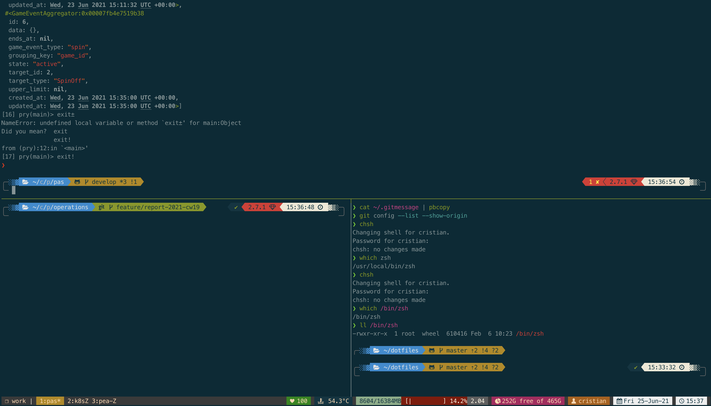

# Dotfiles

This repo is a collection of my dotfiles and configurations for zsh, tmux, vim, git and some custom scripts.
It contains:

- aliases.zsh
- .asfrc
- Brewfile for Brew packages
- Global .gitattributes, .gitconfig and .gitignore
- Ruby's .gemrc, .pryrc
- Scripts on Mac for battery, disk usage and temperature
- .tmux.conf
- .vimrc
- Zsh configs .zlogin, .zprofile, .zshrc

## Installation

1. Install [Brew](https://brew.sh/)
2. Clone the repo `git clone https://github.com/cristianriano/dotfiles.git ~/dotfiles`
3. Run `aliases.zsh` and then the function `dotfiles_link` on the shell
4. Run `brew bundle` inside the repo
5. Set `zsh` as the default shell `chsh -s /bin/zsh`
6. Open a new terminal, it should download `zinit` and install the packages (you might have to do it multiple times)

## Mac Configurations

### Keyboard

_Change between Desktops_
Keyboard settings > Shortcuts > Mission Control
Move left a space Ctrl-Cmd-Left

## Cheatsheet

### ASDF
- List all available versions\
`asdf list`

- Current versions\
`asdf current`

- Update all plugins\
`asdf plugin update --all`

- Reshim
`asdf reshim ruby`

### Go
- Install package from source\
`go get github.com/mikefarah/yq/v4`

### Tmux
- New session\
`tmux new -s work`

- Attach
`tmux attach -t work`

### Git
- List configuration\
`git config --list --show-origin`

- Rubocop Prehook
```
touch .git/hooks/pre-commit
chmod +x .git/hooks/pre-commit
git diff --diff-filter AM --name-only --staged | grep "\.rb$" | xargs bundle exec rubocop --parallel --disable-pending-cops
```

### Docker
- Run auto-cleaned container command\
`docker run -it --rm ubuntu /bin/bash`

- Buildx and tag
`docker buildx build --tag mytag:1.0 --build-arg key=value --ssh default .`

- Buld with custom cache
`docker buildx build --tag mytag:1.0 --file Dockerfile --cache-from=type=local,src=/tmp/.buildx-cache --cache-to=type=local,dest=/tmp/.buildx-cache .`

## Known Issues

### Erlang/Elixir observer doesn't update
When running the Erlang observer `:observer.start` it doesn't render properly on Mac\
[Solution](https://github.com/elixir-lang/elixir/issues/9997#issuecomment-624390925)

### Installing Erlang 24
When installing Erlang 24 you get a message error about crypto library like this:
> checking for OpenSSL in /usr/local/opt/openssl@1.1... configure: error: neither static nor dynamic crypto library found in /usr/local/opt/openssl@1.1

[Solution](https://youtu.be/w7JkhGrjnMY?t=94)

## Screenshots


