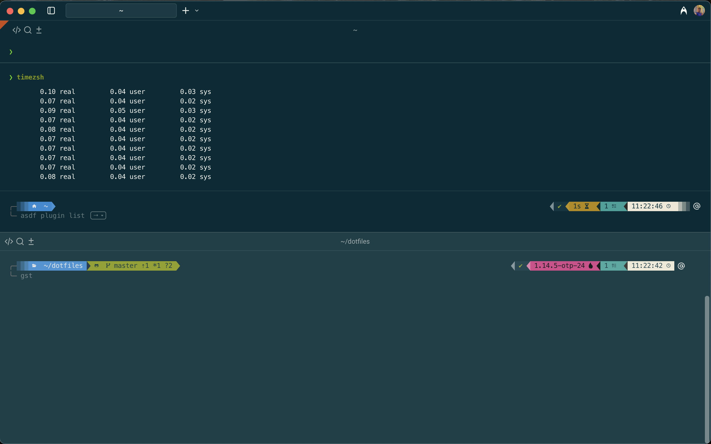

# Dotfiles

This repo is a collection of my dotfiles and configurations for zsh, tmux, vim, git and some custom scripts.

Workspace uses [Warp](https://www.warp.dev/) terminal, [Powerlevel10k](https://github.com/romkatv/powerlevel10k)
theme and [zi from zshell](https://wiki.zshell.dev/) plugin manager.

Files it provides:

- aliases.zsh (custom aliases and functions)
- zi-config.zsh (plugin installation and configuration for zi)
- keybindings.zsh
- .p10k.zsh and .p10k-lean.zsh (full and lite config for theme)
- .asdfrc and .default-\* (for asdf config and plugins)
- Brewfile for Brew packages
- Global .gitattributes, .gitconfig and .gitignore
- Ruby's .gemrc, .pryrc
- Elixir's .iex.exs
- Scripts on Mac for battery, disk usage and temperature
- .sqliterc (sqlite3)
- .tmux.conf
- nvim config
- Zsh configs (in execution orderder)
  - .zshenv
  - .zprofile
  - .zshrc
  - .zlogin

## Installation

1. Install [Brew](https://brew.sh/) (This will also install dev tools if missing e.g `git`)
2. Create a new ssh-key `ssh-keygen -t rsa -C "<email>" -b 4096` and add it as your default identity `ssh-add ~/.ssh/id_rsa`
3. Clone the repo `git clone https://github.com/cristianriano/dotfiles.git ~/dotfiles`
4. Run `source aliases.zsh` and then the functions `dotfiles_link` and `config_link` on the shell
5. Run `brew bundle` inside the repo (check commented dependencies if needed)
6. [OPTIONAL] Set `zsh` as the default shell `chsh -s /bin/zsh`
7. Open a new terminal, it should download `zi` and install the packages (you might have to do it multiple times)
8. Open `nvim` to install [LazyVim](https://www.lazyvim.org/) (install lua > 5.1 first)

### Elixir

Installing Elixir requires Erlang too. We will use `asdf` to be able to have multiple versions.

Elixir versioning have `x.y.z-otp-w`, this is a pre-compiled version for W major Erlang version. The
version without `otp` is that compiled against the oldest OTP release supported by that version. We
will go with the precompiled version of the major Erlang supported.

1. Install dependencies with brew (table below). The only recommended one is `wxmac` to run the observer.
   Use `brew install --build-from-source wxmac`
2. Install the latest Erlang compatible with the Elixir version you want `asdf install erlang x.y`
   (Optional: Install documentation for Erlang modules with `KERL_BUILD_DOCS=yes` used in iex)\
   **NOTE: When installing OTP < 25 set export KERL_CONFIGURE_OPTIONS="--with-ssl=$(brew --prefix openssl) --without-javac"**
3. Install elixir precompiled version for the Erlang chosen

| Dependency | Required? | Why install?                                |
| ---------- | --------- | ------------------------------------------- |
| fop        | 🚫        | Only for building PDF docs                  |
| unixodbc   | 🚫        | Only if you use ODBC                        |
| openjdk    | 🚫        | Already have JDK; optional for Java interop |
| wxmac      | 🔶        | Optional but recommended for :observer      |

## Terminal

### Font

Terminal needs a Nerd font to allow you see all the icons & glyphs in the prompt.

This setup uses `MesloLGM Nerd Font` which is downloaded automatically and saved in `~/Library/Fonts/`
by ZI the first time zhell is started.

If the Font is not detected by the system copy+paste them in the _Font Book_

### iTerm

Set the Font by going to _Preferences > Profiles > Text > Font_

### Warp

Change the following _Settings_:

1. Set the `Meslo` Font _Appearance > Text > Terminal Font_
2. Activate prompt go to _Features > Session > Honor user's custom prompt (PS1)_
3. Dim inactive panes _Appearance > Panes > Dim inactive_
4. Change themes _Appearance > Themes_

- Sync with OS
- Solarized Dark & Light

### Zhell

This configuration uses [ZI](https://z-shell.pages.dev/) for loading plugins, and leverages the Turbo mode to
increass loading speed (currently ~300ms, run `timezsh` for a report from initializing zsh 10 times).

To check the time to load each package\
`zi time`

To update and compile it run\
`zi self-update`

#### Packages list

- [Autosuggestions Fish style](https://github.com/zsh-users/zsh-autosuggestions)
- [Additional completions for zsh](https://github.com/zsh-users/zsh-completions)
- [Prezto completions](https://github.com/sorin-ionescu/prezto/tree/master/modules/completion)
- [Auto pair/delete delimiters](https://github.com/hlissner/zsh-autopair)
- [FZF - Command line Fuzzy Finder](https://github.com/junegunn/fzf)
- [Fasd](https://github.com/clvv/fasd)
- [ASDF - Version Manager](https://github.com/asdf-vm/asdf)
- [History search multi world](https://github.com/z-shell/history-search-multi-word)
- [History substring search](https://github.com/zsh-users/zsh-history-substring-search)
- [Fast Highlighting](https://github.com/z-shell/fast-syntax-highlighting)
- [diff-so-fancy](https://github.com/so-fancy/diff-so-fancy)
- [Power 10K theme](https://github.com/romkatv/powerlevel10k)

## Configurations

### Keyboard

#### Change between Desktops

Keyboard settings > Shortcuts > Mission Control

1. Move left a space -> Ctrl-Cmd-Left
2. Disable Ctrl-Up and Ctrl-Down

#### Key repetition

Keyboard settings > Keyboard

1. Key repeat -> Fast
2. Delay Until repeat -> Short

#### Disable conflicting shortcuts

Keyboard settings > Shortcuts

1. Services > Text

- Search man page index in Terminal (Cmd+Shift+A)

2. Mission Control

- Mission Control
- Application Window

### Apps

#### BetterSnapTool

Installed from Appstore ([homepage](https://folivora.ai/bettersnaptool))
Used for window management. Set the shortcuts for:

- Left half: Cmd+Alt+Ctrl+Left
- Right half: Cmd+Alt+Ctrl+Right
- Maximize: Cmd+Alt+Ctrl+M
- Maximize on next monitor: Cmd+Alt+Ctrl+Up

## Cheatsheet

### Vim

There is a minimalistic Vim setup using [vim-plug](https://github.com/junegunn/vim-plug).
Install plugins with `:PlugInstall` (make sure to install **any node and java version** before otherwise **YouCompleteMe** plugin will fail)

To install new plugins add them to `.vimrc` and run `:PlugInstall` in vim

### ASDF

Available plugins [here](https://github.com/asdf-vm/asdf-plugins)

- List all available versions\
  `asdf list`

- Current versions\
  `asdf current`

- Update all plugins\
  `asdf plugin update --all`

- Reshim
  `asdf reshim ruby`

#### Direnv

Direnv loads env variables when navigating to a folder with `.envrc`

There is also a [plugin](https://github.com/asdf-community/asdf-direnv) with `asdf` to avoid the roundtrip to the shims. To enable it in a parent folder\
`echo 'use asdf' > .envrc`

And then allow the execution by running\
`direnv allow`

### Ruby

- Generate a UUID on the fly\
  `ruby -r securerandom -e 'puts SecureRandom.uuid'`

### Go

- Install package from source\
  `go install github.com/mikefarah/yq/v4@latest`

### Tmux

- New session\
  `tmux new -s work`

- Attach
  `tmux attach -t work`

### Git

- List configuration\
  `git config --list --show-origin`

- Rubocop Prehook

```
touch .git/hooks/pre-commit
chmod +x .git/hooks/pre-commit
git diff --diff-filter AM --name-only --staged | grep "\.rb$" | xargs bundle exec rubocop --parallel --disable-pending-cops
```

### Docker

- Run auto-cleaned container command\
  `docker run -it --rm ubuntu /bin/bash`

- Buildx and tag
  `docker buildx build --tag mytag:1.0 --build-arg key=value --ssh default .`

- Buld with custom cache
  `docker buildx build --tag mytag:1.0 --file Dockerfile --cache-from=type=local,src=/tmp/.buildx-cache --cache-to=type=local,dest=/tmp/.buildx-cache .`

## Known Issues

### Global versions not detected

If direnv is not creating the executable to the correct versions defined in `.tool-versions` then run `direnv reload`

### Installing Erlang 24

When installing Erlang 24 you get a message error about crypto library like this:

> checking for OpenSSL in /usr/local/opt/openssl@1.1... configure: error: neither static nor dynamic crypto library found in /usr/local/opt/openssl@1.1

[Solution](https://youtu.be/w7JkhGrjnMY?t=94)

### Compinit error messages

```
rm ~/.zcompdump* && compinit
```

## Screenshots


